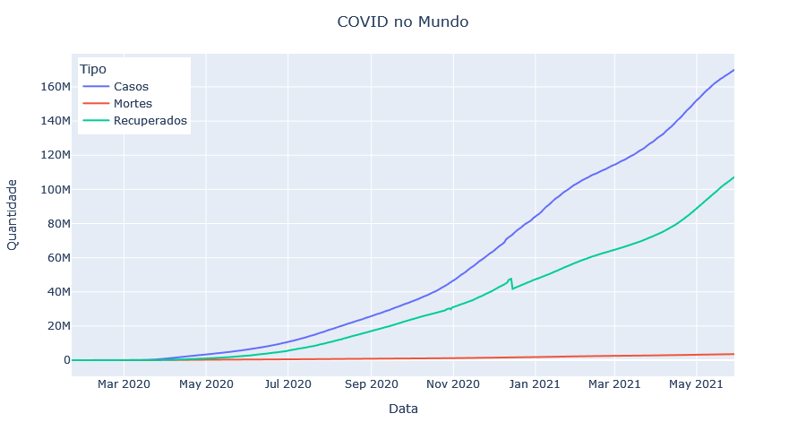
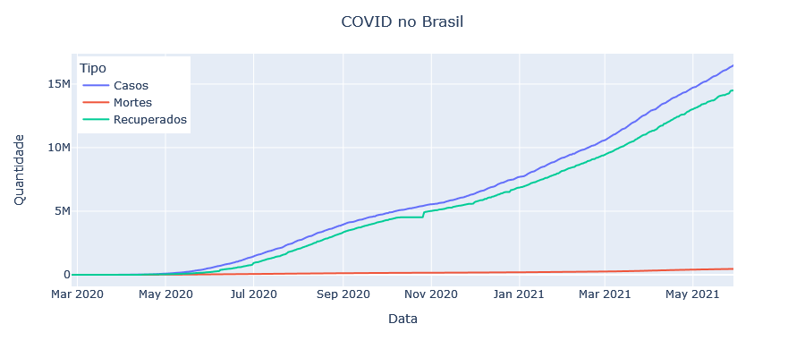
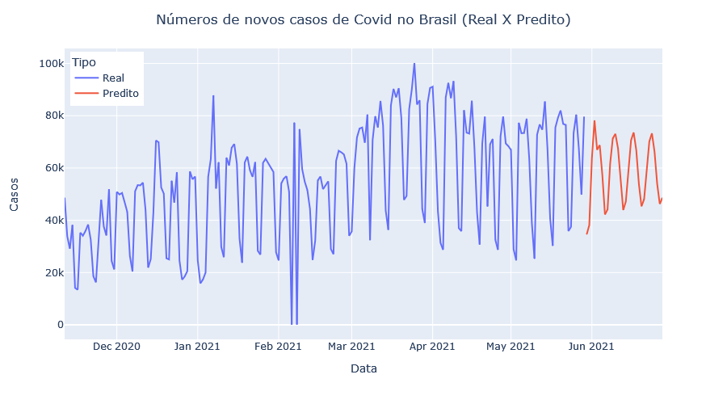

# DigitalInnovationOne: Análise de dados com Python e Pandas

Projeto prático "Criando modelos com Python e Machine Learning para prever a evolução do COVID-19 no Brasil" da Digital Innovation One.

## Arquivos

AnaliseCovid.html

AnaliseCovid.ipynb

Modelo_ARIMA-Covid-Brasil.pkl

## Plots

## Referências

DIO (Digital Innovation One): Criando modelos com Python e Machine Learning para prever a evolução do COVID-19 no Brasil

KAGGLE - Novel Corona Virus 2019 Dataset: https://www.kaggle.com/datasets/sudalairajkumar/novel-corona-virus-2019-dataset

TOWARDS DATA SCIENCE - Time Series forecasting using Auto ARIMA in python: https://towardsdatascience.com/time-series-forecasting-using-auto-arima-in-python-bb83e49210cd